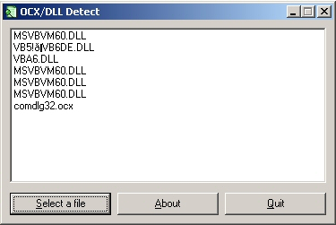



## OCX/DLL Detect \- Find required OCX and DLL Files

### Description

You can find all required OCX and DLL files in your own VB projects.
 
### More Info
 

             |
---                |---
**Submitted On**   |2003-11-04 17:50:02
**By**             |[hax](https://github.com/Planet-Source-Code/PSCIndex/blob/master/ByAuthor/hax.md)
**Level**          |Intermediate
**User Rating**    |4.5 (18 globes from 4 users)
**Compatibility**  |VB 5\.0, VB 6\.0
**Category**       |[Miscellaneous](https://github.com/Planet-Source-Code/PSCIndex/blob/master/ByCategory/miscellaneous__1-1.md)
**World**          |[Visual Basic](https://github.com/Planet-Source-Code/PSCIndex/blob/master/ByWorld/visual-basic.md)
**Archive File**   |[OCX\_DLL\_De1667611142003\.zip](https://github.com/Planet-Source-Code/hax-ocx-dll-detect-find-required-ocx-and-dll-files__1-49669/archive/master.zip)

